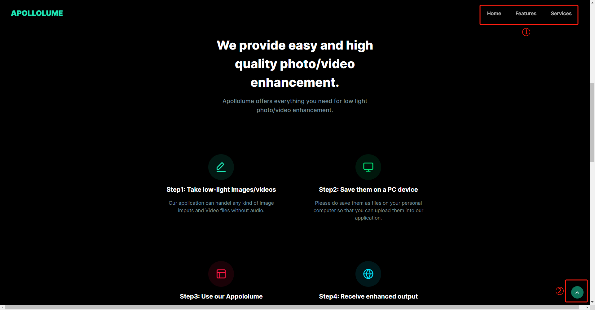
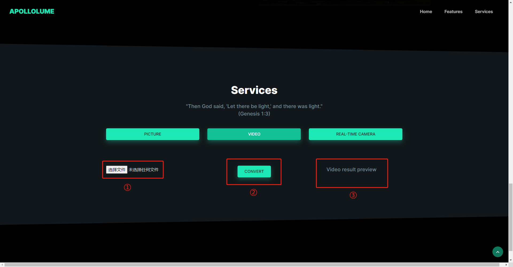

# Apollolume

## Contributors

| Full Name     | Student ID  |
| -------------  | ----------  |
| Liu Siyan     | A0285857H   |
| Lin Zijun     | A0285897Y   |
| Lai Weichih   | A0285875H   |
| Fang Ruolin   | A0285983H   |
| Bian Weizhen  | A0285814W   |

## Installation and User Guide

### Introduction

Apollolume is a web-based intelligent system application that helps users enhance photos or videos taken at night or in low-light conditions. Besides that, it also provides powerful real-time camera enhancement together with violence detection. The purpose of this Installation and User Guide is to help users successfully get into our application and understand how to use our application.

### Installation

If you want to use our page locally on your computer, before running our website, your environment will need to have Python version 3.11.6 or higher, and the following essential libraries installed:

| Libraries      | Version  |
| --------------- | -------  |
| flask           | 2.2.2    |
| pandas          | 1.5.3    |
| numpy           | 1.24.3   |
| Pytorch         | 2.0.0+   |
| Torchvision     | 0.16.0   |
| Opency-python   | 4.8.0    |
| scikit-image    | 0.20.0   |
| pillow          | 9.4.0    |
| numPy           | 1.24.3   |
| tempfile        | 3.7.0    |
| gunicorn        | 21.2.0   |
| Werkzeug        | 2.2.2    |

After that, please download our project file, and then open a terminal, and here is the process of deploying our website to your local host:

1. `cd <path of the system>/Apollolume`
2. `python camera_stream.py`

In the terminal it will tell you which host it uses (usually the http://127.0.0.1:5001/). Then open a browser and type in the corresponding port number and you will get into our project locally.

### Overview

Overall we have 3 sections on our page (also as you can see in the navigation bar on top of the website). The first section you see when you first get into our page is the home page section:

Here you can see a "GET STARTED NOW" button (1) in the middle and a navigation bar (2) on the top which contains the three sections of our page. For the "GET STARTED NOW" button, if you click it, it will direct you to our service section, and for the navigation bar, it will direct you to each indicated section of our page (Home, Features, Services).

Next, if you scroll down or click on the "Features" in our navigation bar, you will go to the second section of our page which is the Features section:

Here we illustrate the process of using Apollolume and the different features of our application. The only thing worth mentioning is that at the top of the page, you can see our navigation bar (1) will always be following you when you browse our page. When you scroll down it will hide but if you scroll up it will show up. There is another button at the right bottom corner (2) directing you back to the top of the page.

Next, if you keep scrolling down or click on the "Services" in our navigation bar, you will go to the last section of our page where our main functions are located: Services section.

For the following part of the User Guide, we will emphasize and illustrate every detail of how to use everything in our Services section.

### Services

#### Picture Enhancer

This is the default function area of our page. As you can see the "picture" button is pre-selected, so here it shows the first function of our application: Picture Enhancer.

Here you can see four major areas and one submit button. Let us go through them one by one starting from the top which is also the best order to use this part of our services.

The first component is three buttons in the middle of the page which are "PICTURE," "VIDEO," and "REAL-TIME CAMERA" representing our Photo Enhancer, Video Enhancer, and Real-time Camera Enhancer together with Violence Detection. Here users can switch to different functions by pushing different buttons, and once the page is initially loaded, the PICTURE button will be selected as default.

The second component is the image file input field (2). Here there is an upload button for users to upload their intended image files.

The third component is the "CONVERT" button (3). After our users upload their image input file, they can click the convert button and wait for seconds depending on the file size and the complexity of the image, and finally, the enhanced result image will be shown in the fourth component area (4).

#### Video Enhancer

After part 1, we will have another service which is Video Enhancer:

It is the same format as the Picture Enhancer. Here on the left is the area for users to upload their video files (1). After uploading, our users can click the convert button (2), and the enhanced video will be shown on the right side (3).

#### Real-time camera Enhancer and violence detection

After the Video Enhancer service, next is the last part of our service, Real-time camera Enhancer and violence detection:

Here on the left side, after users click the "ENABLE CAMERA" button (2), the real-time enhanced output frames will be presented here (1). Once the camera is enabled and our application can successfully capture and present the enhanced frames, our users can click the "DETECT" button to enable the violence detection function, and the real-time detection result will be printed on the right side of the page (4).

Lastly, all of three functions of our services are separated from each other, which means the input for one area will not be brought to any other area, and any contents in one area will be cleaned once the users switch to using another function. Please enjoy using our Apollolume!
